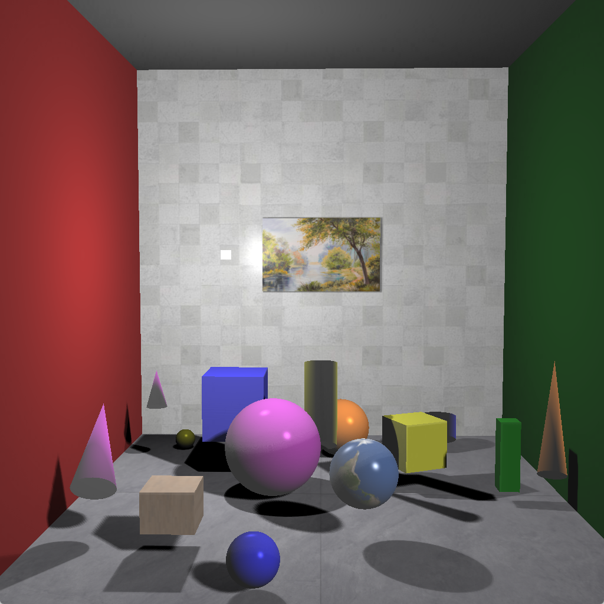
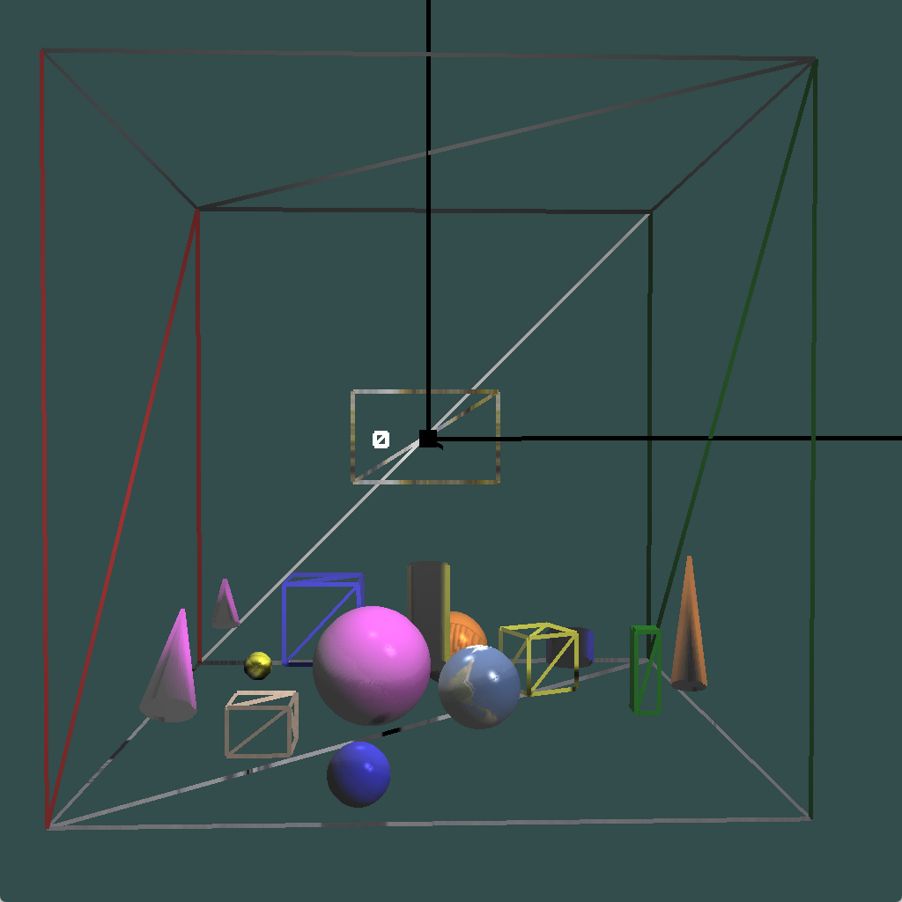

# 计算机图形学实验作业报告
***256515 王安琪***

**项目效果演示见项目源文件中 `效果演示.mp4` 和 `效果演示-点光源 only.mp4` 视频。**

## 1. 使用手册

本项目采用 **C++ + OpenGL（GLFW + GLAD）** 实现一个带有完整光照、材质、阴影和多几何物体的三维 Cornell Box 场景。工程结构清晰，可在 Windows 与 Macos 下通过 CMake 构建。

### 1.1 运行环境
- C++17
- OpenGL 4.1 Core Profile
- GLFW3（窗口和输入）
- GLAD（OpenGL 函数加载）
- stb_image（贴图加载）
- CMake ≥ 3.10

### 1.3 编译方式
#### 1.2.1 windows

使用 [minGW](https://github.com/niXman/mingw-builds-binaries/releases) 进行编译，步骤如下
1. 确保已将 MinGW 的 bin 目录添加到系统环境变量 Path 中（避免编译时找不到工具链）。
2. 打开 **PowerShell** ，执行以下命令启动构建：

```bash
cd cg_project
.\build_windows.bat
```

#### 1.2.2 macOS

使用 [Homebrew](https://brew.sh/) 安装依赖 glfw：

```bash
brew install glfw
```

打开终端，执行以下命令启动构建：
```bash
cd cg_project
# 先给脚本加执行权限（只需要做一次）
chmod +x build_macos.sh
./build_macos.sh
```

### 1.4 项目结构
```
cg_project
├─ CMakeLists.txt // CMake 配置文件
├─ build_macos.sh // macOS 构建脚本
├─ build_windows.bat // Windows 构建脚本
├─ image // 实验报告插图
│  ├─ cornell_box.png
│  └─ debug_mode.png
├─ include // 头文件
│  ├─ GLFW
│  ├─ KHR
│  ├─ glad
│  ├─ glm
│  └─ stb_image.h
├─ lib // 库文件
│  └─ libglfw3.a
├─ readme.md // 项目说明
├─ shader // 着色器文件
│  ├─ default_fragment_shader.fs // 默认片段着色器
│  ├─ default_vertex_shader.vs // 默认顶点着色器
│  ├─ normal_fragment_shader.fs // 法线片段着色器
│  ├─ normal_vertex_shader.vs // 法线顶点着色器
│  ├─ phone_fragment_shader.fs // phone片段着色器，带阴影
│  ├─ phone_vertex_shader.vs // phone顶点着色器，带阴影
│  ├─ point_shadow_fragment_shader.fs // 点光源阴影片段着色器
│  ├─ point_shadow_vertex_shader.vs // 点光源阴影顶点着色器
│  ├─ shadow_fragment_shader.fs // 平行光源阴影片段着色器
│  └─ shadow_vertex_shader.vs // 平行光源阴影顶点着色器
├─ src // 源文件
│  ├─ Camera.cpp 
│  ├─ Camera.h // 相机类
│  ├─ Shader.cpp
│  ├─ Shader.h // 着色器类
│  ├─ glad.c
│  ├─ light // 光源
│  │  ├─ DirectionalLight.h // 平行光源
│  │  ├─ Light.h // 光源基类
│  │  └─ PointLight.h // 点光源
│  ├─ main.cpp // 主程序
│  ├─ material // 材质
│  │  ├─ Material.h // 材质基类
│  │  ├─ PhoneMaterial.cpp
│  │  ├─ PhoneMaterial.h // phone材质
│  │  ├─ PureColorMaterial.cpp
│  │  ├─ PureColorMaterial.h // 纯色材质
│  │  ├─ TexturedPhoneMaterial.cpp
│  │  └─ TexturedPhoneMaterial.h // 带贴图的phone材质
│  ├─ object // 几何体
│  │  ├─ Cone.cpp
│  │  ├─ Cone.h // 圆锥
│  │  ├─ Cube.cpp
│  │  ├─ Cube.h // 立方体
│  │  ├─ Cylinder.cpp
│  │  ├─ Cylinder.h // 圆柱
│  │  ├─ Object.h // 几何体基类
│  │  ├─ Plane.cpp 
│  │  ├─ Plane.h // 平面
│  │  ├─ Sphere.cpp
│  │  └─ Sphere.h // 球体
│  ├─ stb_image_impl.cpp
│  ├─ texture // 贴图
│  │  ├─ Texture.cpp
│  │  └─ Texture.h // 贴图类
│  └─ tool // 工具类
│     ├─ Line.cpp
│     ├─ Line.h
│     ├─ Point.cpp
│     └─ Point.h
├─ texture // 贴图文件
│  ├─ brick.jpeg
│  ├─ earth.jpg
│  ├─ floor.jpeg
│  ├─ painting.jpg
│  ├─ wall.jpg
│  └─ wood.jpg
├─ 实验报告.md
├─ 实验报告.pdf
├─ 效果演示-点光源 only.mp4
└─ 效果演示.mp4
```

### 1.5 相机控制交互方式

程序内置类似 FPS 的自由相机：

- **W / S**：前进 / 后退

- **A / D**：左移 / 右移

- **鼠标移动**：调整视角（yaw/pitch）

- **鼠标滚轮**：缩放视场角（FOV）

- **Esc**：退出程序

### 1.6 场景内容概述

程序运行之后，可以看到一个由多个平面围成的景箱 **（Cornell Box）**，内部布置了：

{width=50%}

- 左边的红墙和右边的绿墙

- 对面墙面的画

- 具有材质贴图的墙和地板

- 不同材质和贴图的立方体、球体、圆柱、圆锥

- 动态旋转的点光源(图中白色立方体)与平行光源(方向为 $\mathrm{vec3}(-1 -1 -1)$)

- PCF 软阴影

- 使用 Phong 光照模型的高光、漫反射与环境光

整体效果接近一个可交互的三维室内展示空间。

### 1.7 Debug mode

在`main.cpp` 中，通过 `bool debugMode = true;` 可以开启 debug 模式，此时会渲染物体的线框，场景的原点以及三个坐标轴，便于调试。

{width=50%}

## 2. 设计思路

本实验的整体目标是构建一个 **真实感较强、结构清晰、可交互、具备阴影与纹理的三维场景渲染**。为了达到这一目标，我采用了偏向“图形引擎架构”的设计方式：从基础模块（Shader / Texture / Camera）开始，再逐步叠加光照、阴影、材质与对象体系，最终组合成复杂场景。
## 2.1 模块化架构思想（Engine-style 架构）

为了避免把所有逻辑写在 `main.cpp` 中，我按真实渲染引擎的方式，将项目拆分为七大系统：

### **（1）Shader 系统：渲染语言与 CPU-GPU 通道**
独立封装 Shader，使它承担以下职责：

- 加载 .vs / .fs 文件
- 编译、链接、检测错误
- 缓存并设置 uniform（setInt / setFloat / setVec3 / setMat4…）
- 与材质、光照、模型的交互接口

Shader 是 GPU 执行逻辑的核心。因此把 Shader 抽象成模块，使 CPU 端逻辑与 GPU 端 shader 代码保持松耦合。

### **（2）Camera 系统：可漫游的交互式三维视角**
Camera 模块实现了典型 **FPS-style 相机**：

- WASD 进行平移
- 鼠标控制 yaw/pitch
- 滚轮控制 zoom
- 生成 viewMatrix 与 projectionMatrix

### **（3）Light 系统：支持多光源类型**
项目包含三类光照：

- DirectionalLight（方向光）  
  → 模拟太阳光，生成大面积阴影
- PointLight（点光源）  
  → 用于局部照亮，生成实时立体阴影
- Ambient 成分  
  → 模拟环境光，确保暗部不完全黑

每种光源都具有材质化属性（diffuse / specular / ambient），且通过 shader 统一管理。

### **（4）Material 系统：现实感渲染的基础**
实验实现了三类材质：

- **PureColorMaterial**：无光照，用于 debug  
- **PhongMaterial**：经典光照模型  
- **TexturedPhongMaterial**：加入漫反射纹理的版本  

所有材质均继承自同一个抽象基类 Material，并统一通过  `material->apply(shader);`  把材质参数传到 GPU。这样做能实现 **“材质可热插拔”** 的效果，不同 object 只需替换材质即可获得不同外观。

### **（5）Object 系统：抽象几何体的统一接口**
Object 是所有几何体的抽象父类，包含：

- VAO/VBO/EBO 的封装
- model 矩阵
- shader 与材质指针
- draw() 渲染接口

子类（Cube / Sphere / Cone / Cylinder / Plane）只关心自己的几何数据；  
渲染逻辑由 Object 负责；  
shader 和材质由 material 决定。

这是一种典型的“**抽象几何体接口 + 多态渲染**”的设计方式。


### **（6）Texture 系统：图像数据与 OpenGL 纹理的桥梁**
Texture 模块负责：

- 使用 stb_image 读取图片
- 翻转、RGB/rgba 判断、数据加载
- 生成 OpenGL 纹理对象并绑定

纹理被材质持有，然后在渲染时绑定到统一的 texture unit。

### **（7）Shadow 系统：真实感的关键组成**
实现了两套阴影技术：

#### **1）Shadow Map（平行光）**
- 光源先从自己的视角渲染场景深度
- 再在主渲染中比较片元深度是否被遮挡

#### **2）Cube Shadow Map（点光源）**
- 六次深度渲染生成立方体深度贴图
- 根据片元方向决定 cube face 采样


## 2.2 场景构建策略（扩展版康奈尔盒）

为了让实验场景既有教学意义又不显得空，我采用了 **“康奈尔盒”**：

### **（1）基础环境：全由 Plane 构建**
- 地面：带纹理（floor.jpeg）
- 左墙：红色
- 右墙：绿色
- 天花板：白色
- 后墙：贴 wall.jpg

通用的康奈尔盒提供了稳定的光照环境，便于展示阴影效果。

### **（2）十余个物体构成“展览布局”**
包含：

- 大方块 / 倾斜方块
- 大球、小球、带纹理的地球球
- 高圆锥、矮圆锥
- 金属材质的圆柱体
- 木纹立方体
- 后墙挂画

## 2.3 光照设计（真实感的核心）

为了让场景效果尽量真实，我使用了双光源结构：

### **（1）主光源：方向光（Directional Light）**
相当于“太阳光”：

- 方向固定  
- 覆盖整个场景  
- 使用正交投影  
- 负责生成大面积阴影  

方向光让场景具备 **整体统一的主光照和清晰的大阴影区域**。


### **（2）辅助光源：点光源（Point Light）**
点光源可以进行动态绕 y 轴旋转，用来：

- 产生动态局部照明
- 在球体、金属柱上生成高光
- 提供立体阴影（Cube Shadow Map）

点光源让场景显得鲜活、有节奏变化。


### **（3）软阴影（PCF 模糊）**
阴影是场景真实感的决定性因素。为避免锯齿形状，我对每个阴影采样点进行：

- 3×3 / 5×5 随机偏移 PCF 模糊  
- 深度偏移 bias 防止 acne  
- 线性深度衰减控制柔和程度  

最终得到柔和、自然、不突兀的阴影边缘。

## 3. 实现

本项目整体采用“**初始化 → 预处理（阴影图）→ 正常渲染 → 交互控制**”的架构。核心代码集中在 `main.cpp` 中，其余模块以类的形式进行封装，保证结构清晰、便于扩展。

### 3.1 渲染流程

主渲染循环（`while (!glfwWindowShouldClose(window))`）中，每一帧的具体流程如下：

#### （1）更新帧时间与相机输入

1. 使用 `glfwGetTime()` 计算当前帧时间与上一帧时间差 `deltaTime`。
2. 调用 `processInput(window, deltaTime)`：
   - 根据 `W / A / S / D` 键的按下与否，更新 `keys[]` 数组；
   - 将 `keys` 传给 `camera.ProcessKeyboard(deltaTime, keys)`，在世界坐标系中进行平移。
3. 鼠标与滚轮的回调函数 `mouse_callback`、`scroll_callback` 已在初始化阶段注册，用来更新相机的 `yaw / pitch / zoom`，最终影响 `view` 矩阵与 `projection` 矩阵。

#### （2）更新点光源位置（动画）

在每一帧中，根据时间 `currentFrame`，让点光源沿 Y 轴做圆周运动：

- 使用 `angle = rotationSpeed * currentFrame`（转为弧度）计算当前旋转角；
- 点光源位置更新为：
  - `x = radius * cos(angle)`
  - `z = radius * sin(angle)`
  - `y` 高度保持不变
- 同步更新表示点光源实体的小立方体的 `model` 矩阵，使其在场景中随光源一起运动。

这样可以直观观察到 **阴影随点光源位置实时变化** 的效果。

#### （3）渲染平行光阴影贴图（Directional Light Shadow Map）

1. 构建光源空间矩阵：
   - 使用 `glm::ortho` 构建正交投影矩阵 `lightProjection`，保证整个康奈尔盒都在光源视锥体内。
   - 使用 `glm::lookAt` 根据平行光的方向构建 `lightView`，将光源放在 `-dir * 某个距离` 的位置，看向场景中心。
   - 得到 `lightSpaceMatrix = lightProjection * lightView`。

2. 绑定阴影 FBO：
   - `glViewport(0, 0, SHADOW_WIDTH, SHADOW_HEIGHT)` 将视口切换为阴影贴图的分辨率（1024×1024）。
   - 绑定 `depthMapFBO`，清空深度缓冲。

3. 使用专用深度着色器 `shadowShader`：
   - 仅计算 `gl_Position = lightSpaceMatrix * model * vec4(position, 1.0)`；
   - 片元阶段只写入深度，不输出颜色。

4. 遍历所有 `objects`：
   - 对每个物体设置 `uModel`，调用 `obj->renderVertex()` 渲染顶点。
   - 渲染结果写入 **深度纹理 `depthMap`** 中。

5. 渲染完成后解绑 FBO，恢复窗口大小的视口。

#### （4）渲染点光源立方体阴影贴图（Point Light Shadow CubeMap）

点光源阴影使用 **深度立方体贴图**，需要对 6 个方向分别渲染深度：

1. 构建透视投影矩阵：
   - 使用 `glm::perspective(glm::radians(90.0f), 1.0f, 0.1f, pointLightFar)`，FOV 为 90°，宽高比为 1。

2. 为 6 个方向构建视图矩阵 `pointViews[i]`：
   - 朝 +X、−X、+Y、−Y、+Z、−Z 六个方向 lookAt；
   - up 向量根据方向不同略有调整，避免视图翻转。

3. 绑定 `pointDepthMapFBO`，设置视口为立方体贴图尺寸（2048×2048），清空深度缓冲。

4. 启用 `pointShadowShader`：
   - 设置 `uLightPos` 为点光源位置；
   - 设置 `uPointLightFar` 为点光源的远平面值，用于深度归一化。

5. 循环 6 个面：
   - 每次将当前面绑定到 FBO 的深度附件上：
     `glFramebufferTexture2D(GL_FRAMEBUFFER, GL_DEPTH_ATTACHMENT, GL_TEXTURE_CUBE_MAP_POSITIVE_X + i, pointDepthMap, 0);`
   - 计算 `pointVPMatrix = pointProjection * pointViews[i]` 并传入 shader 的 `uPointVPMatrix`；
   - 遍历所有物体，设置 `uModel`，调用 `renderVertex()` 渲染。

最终得到一个 6 面深度立方体贴图 `pointDepthMap`，每一面记录了点光源视角下的场景深度信息，可以用于点光源阴影判断。

#### （5）正常渲染场景（带阴影）

1. 恢复默认帧缓冲与窗口视口：
   - `glBindFramebuffer(GL_FRAMEBUFFER, 0);`
   - `glViewport(0, 0, SCR_WIDTH, SCR_HEIGHT);`
   - 清空颜色与深度缓冲。

2. 计算相机矩阵：
   - `view = camera.GetViewMatrix();`
   - `projection = camera.GetProjectionMatrix(SCR_WIDTH / SCR_HEIGHT);`

3. 先绘制点光源实体小立方体，用默认 shader 与纯色材质，帮助观察光源轨迹。

4. 遍历所有场景物体 `objects`：
   - 使用物体自身绑定的 `shader`（一般是 Phong 或 TexturedPhong）；
   - 设置变换与光照相关 uniform：
     - `uModel`、`uView`、`uProjection`
     - `uLightSpaceMatrix`（用于平行光阴影）
     - 绑定并设置：
       - `uShadowMap` → 2D 深度纹理 `depthMap`
       - `uPointShadowMap` → 立方体深度纹理 `pointDepthMap`
     - 设置光源结构体参数 `dirLight`、`pointLight`（环境光、漫反射、镜面、位置/方向、衰减等）；
     - 设置 `uViewPos` 为相机位置，用于镜面高光计算。

5. 在 fragment shader 中完成：
   - Phong 光照计算；
   - 基于 `uShadowMap` 与 `uLightSpaceMatrix` 的平行光阴影判断；
   - 基于 `uPointShadowMap` 与 光源 → 点 的距离 的点光源阴影判断；
   - 使用 PCF 对阴影深度进行多点采样和平均，使阴影边缘变得柔和。

6. Debug 模式下，还会额外绘制三条坐标轴线与原点，便于观察场景尺度。


### 3.2 主要模块说明（基于源码结构）

#### （1）Shader 模块

文件：`Shader.h / Shader.cpp`

- 负责读取 `.vs` / `.fs` 着色器源码，编译并链接为 OpenGL 程序。
- 内部封装了错误检查与 `glUseProgram`。
- 提供了一系列 `setXXX` 接口：
  - `setMat4(name, glm::mat4)`
  - `setVec3(name, glm::vec3)`
  - `setInt(name, int)`
  - `setFloat(name, float)`
- 让上层代码在 C++ 侧设置 uniform 可以像调用普通函数一样简单。

#### （2）Camera 模块

文件：`Camera.h / Camera.cpp`

- 实现 FPS 风格相机，维护以下状态：
  - `position`：相机位置
  - `front / up / right`：相机坐标系基向量
  - `yaw / pitch`：欧拉角
  - `zoom`（FOV）
- 提供：
  - `GetViewMatrix()`：返回 `lookAt` 形式的视图矩阵；
  - `GetProjectionMatrix(aspect)`：根据 FOV、near/far 生成透视投影矩阵；
  - `ProcessKeyboard(deltaTime, keys[])`：根据 W/A/S/D 更新位置；
  - `ProcessMouseMovement(xOffset, yOffset)`：根据鼠标偏移更新 yaw/pitch；
  - `ProcessMouseScroll(yoffset)`：根据滚轮缩放 FOV。

这样所有与相机相关的逻辑都被封装在一个类里，主循环只需调用上述接口即可。

#### （3）Object 抽象基类与几何子类

文件：`Object.h` 以及 `Cube / Sphere / Plane / Cylinder / Cone` 对应的 `.h/.cpp`

- 抽象基类 `Object`：
  - 成员：
    - `glm::mat4 model`：物体自身的模型变换矩阵；
    - `Shader* shader`：该物体使用的着色器；
    - `Material* material`：材质指针；
    - `unsigned int VAO, VBO, EBO`：OpenGL 缓冲对象句柄。
  - 接口：
    - `virtual void render(glm::mat4 model, glm::mat4 view, glm::mat4 projection)`：完整渲染接口，会调用材质设置参数等；
    - `virtual void renderVertex()`：只画几何，不考虑光照，用于阴影贴图阶段。

- 几何子类（以 Cylinder 为例）：
  - 在构造函数中，通过 `generateCylinderData()` 生成顶点与索引：
    - 顶部/底部圆面中心点；
    - 圆周上的顶点与法线；
    - 侧面四个一组顶点，计算法线（沿半径方向）；
  - 将数据存入 VBO/EBO，配置位置、法线、纹理坐标的顶点属性（layout = 0/1/2）。
  - `renderVertex()` 调用 `glDrawElements(GL_TRIANGLES, indices.size(), GL_UNSIGNED_INT, 0);` 完成绘制。

Sphere、Cube、Plane、Cone 等类实现方式类似，只是几何生成方式不同。

#### （4）Light 模块

文件：`Light.h / DirectionalLight.h / PointLight.h`

- `Light` 基类定义光源的公共接口；
- `DirectionalLight`：
  - 成员：`direction`、`ambient`、`diffuse`、`specular`
  - 提供 `applyLight(Shader& shader, const std::string& name)`，内部调用 `shader.setVec3(name + ".direction", ...)` 等，将光源参数写入 shader 中的结构体：
    ```glsl
    struct DirLight {
        vec3 direction;
        vec3 ambient;
        vec3 diffuse;
        vec3 specular;
    };
    ```
- `PointLight`：
  - 成员：`position`、`ambient`、`diffuse`、`specular`、衰减系数 `constant / linear / quadratic`
  - 同样提供 `applyLight`，向 shader 中写入 `pointLight.position` 等。

这样在 `main.cpp` 里，每一帧只需要执行：
```cpp
dirLight.applyLight(*(obj->shader), "dirLight");
pointLight.applyLight(*(obj->shader), "pointLight");
```
就能把光源信息同步进 GPU。

#### （5）Material 模块

文件：`Material.h / PhoneMaterial.* / PureColorMaterial.* / TexturedPhoneMaterial.*`

- `Material` 为抽象类，定义接口：

    - `virtual void apply(Shader& shader) = 0;`，用于把材质参数传给 shader。

- `PhongMaterial`：

    - 成员：`ambient / diffuse / specular / shininess`

    - apply 时向 shader 写入：

    ```glsl
    struct Material {
        vec3 ambient;
        vec3 diffuse;
        vec3 specular;
        float shininess;
    };
    ```


- `TexturedPhongMaterial`：

    - 在 `PhongMaterial` 基础上增加 `Texture* diffuseMap`；

- `apply` 时绑定纹理到固定纹理单元，并设置 `useTexture = true` 等标志；

- fragment shader 中根据标志决定：

    - 仅使用 `material.diffuse；`

    - 或使用 `texture(diffuseMap, TexCoord)` 作为漫反射颜色。

- `PureColorMaterial`：

    - 极简材质，只输出一种颜色，主要用于点光源小立方体与 debug 对象。

#### （6）Texture 模块

文件：`Texture.h / Texture.cpp`

- 使用 `stb_image` 读取 jpg/png 文件，生成 OpenGL 2D 纹理：

    - 支持水平方向/垂直翻转；

    - 设置 GL_REPEAT、GL_LINEAR_MIPMAP_LINEAR 等参数；

- 通过 `bind()` 方法把纹理绑定到当前活动纹理单元。

- 被 `TexturedPhongMaterial` 等持有，在绘制前统一绑定。

#### （7）阴影（Shadow map）

- 平行光阴影：

    - 通过 depthMapFBO + depthMap 实现；

    - 在深度渲染阶段关闭颜色输出，只写深度；

    - 在 Phong shader 中，把当前片元位置从世界空间变换到光源空间，比较：

        - `当前片元深度` vs. `深度纹理中存储的最小深度` + bias；

- 点光源阴影：

    - 使用 cube map 记录 6 个方向的深度；

    - fragment shader 中根据片元与点光源的方向确定 cube map 采样方向；

    - 比较实际距离与 cube map 中存储的深度，判断是否在阴影中。

 - 使用 PCF：

    - 在深度纹理上取一个小窗口进行多次采样；

    - 统计遮挡比率作为阴影强度，使阴影边缘过渡柔和。


## 4. 小结

本次实验从零构建了一个完整的 **OpenGL 三维渲染场景**，涵盖了：

- 几何建模（Cube / Sphere / Cone / Plane / Cylinder）
- 材质系统（Phong、纹理）
- 光照系统（平行光 + 点光源）
- 阴影映射（Shadow Map + Shadow Cube Map）
- PCF 软阴影
- 三维交互式相机
- 贴图与纹理采样
- 康奈尔盒场景搭建与多物体分布设计

整个实验开发过程，让我完整理解了一个实时渲染管线如何从“几何 → 变换 → 光照 → 材质 → 阴影 → 输出”逐步构成，也加深了我对 OpenGL 底层原理与 shader 思维方式的掌握。

如果进一步扩展，我认为可以加入：
- 全局光照算法
- PBR 材质
- 面光源
- PCSS 软阴影

本次项目是一个完整而扎实的 3D 渲染练习，使我对计算机图形学渲染流程有了系统而深入的理解。
